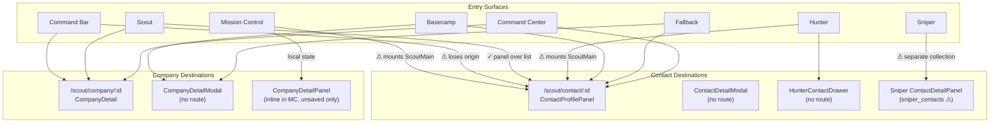
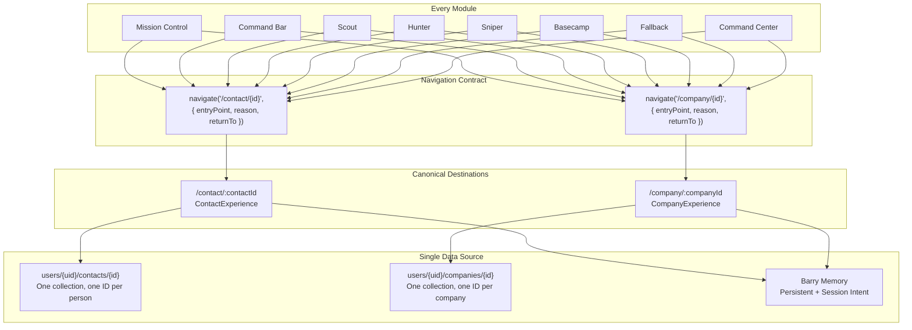

# Contact & Company Experience Foundation Audit

**Idynify · Team Alpha · Discovery Only — No Code**
**Date:** August 4, 2026
**Scope:** 482 source files audited, 8 modules traced

---

## Table of Contents

1. [Object Model](#1-object-model)
2. [Record Lifecycle](#2-record-lifecycle)
3. [Canonical Destination Inventory](#3-canonical-destination-inventory)
4. [Shared Capabilities Inventory](#4-shared-capabilities-inventory)
5. [Identity & Record Resolution](#5-identity--record-resolution)
6. [Priority Workflow Audit](#6-priority-workflow-audit-five-flows)
7. [Remaining Entry Point Audit](#7-remaining-entry-point-audit)
8. [Issue Classification](#8-issue-classification)
9. [Current State Platform Map](#9-current-state-platform-map)
10. [North Star Platform Map](#10-north-star-platform-map)
11. [Context Contract](#11-context-contract)
12. [The Seven Foundation Decisions](#12-the-seven-foundation-decisions)
13. [The Ten Questions Answered](#13-the-ten-questions-answered)
14. [Unknowns Requiring Aaron's Input](#14-unknowns-requiring-aarons-input)
15. [The Smallest Next Sprint](#15-the-smallest-next-sprint)

---

## 1. Object Model

### What is a Contact?

- **Canonical collection:** `users/{userId}/contacts/{contactId}`
- **Schema authority:** `src/schemas/peopleSchema.js` (233 lines) and `src/schemas/engagementSchema.js`
- **Canonical identifier:** Firestore document ID — but its value is **non-uniform** across creation paths.

**Identity fields:** `id`, `first_name`, `last_name`, `name`, `email`, `phone`, `linkedin_url`, `company`, `title`, `industry`, `location`, `photo_url`

**Relationship classification:** `person_type` (lead | customer | partner | network | past_customer), `stage` (scout | hunter | sniper | basecamp | reinforcements | fallback), `relationship_type` (prospect | known | partner | delegate), `warmth_level` (cold | warm | hot), `strategic_value` (low | medium | high | critical)

**Status fields (two parallel systems):**
- `contact_status` — the state machine: New → Engaged → Awaiting Reply → In Conversation → Active Customer / Dormant. Driven by `src/utils/contactStateMachine.js`.
- `status` — a separate field: suggested | pending_enrichment | active | people_mode_archived. Used during discovery. **These two systems can contradict each other.**

#### Document ID varies by creation path

| Creation path | Document ID format | File |
|---|---|---|
| Company swipe auto-discovery | `{companyId}_{apolloPersonId}` | DailyLeads.jsx:1596 |
| CompanyDetail manual add | `{companyId}_{apolloPersonId}` | CompanyDetail.jsx:353 |
| LinkedIn import | `{companyId}_{apolloPersonId}` | LinkedInLinkSearch.jsx:92 |
| Manual form add | Firestore auto-generated | ManualContactForm.jsx:98 |
| CSV upload | Firestore auto-generated | CSVUpload.jsx |
| Business card capture | Firestore auto-generated | BusinessCardCapture.jsx:198 |

### What is a Company?

- **Canonical collection:** `users/{userId}/companies/{companyId}`
- **Schema authority:** `src/schemas/companySchema.js` — explicitly acknowledges that "the six write sites write genuinely different field sets."
- **Canonical identifier:** Firestore document ID. Set to `apollo_organization_id` for Apollo discoveries, auto-generated for manual adds.

#### Apollo ID field naming inconsistency

| Write path | Field name | Dedup query field |
|---|---|---|
| search-companies.js (Apollo discovery) | `apollo_organization_id` | `apollo_organization_id` |
| LinkedInLinkSearch.jsx | `apollo_id` | `apollo_id` |
| CompanySearch.jsx (manual) | `apollo_organization_id` | `apollo_organization_id` |

Because the dedup queries check different field names, the same Apollo company can be saved twice via different paths.

### What is a Discovery Prospect?

Discovery prospects **are Firestore documents from the moment of discovery**. They live in the same collections as canonical records, distinguished only by the `status` field.

- **Companies:** `search-companies.js` writes every Apollo result directly to `users/{uid}/companies` with `status: 'pending'`. Swipe right → `'accepted'`, swipe left → `'rejected'`. Same document transitions.
- **Contacts:** When a user swipes right on a company, matching people are written to `users/{uid}/contacts` with `status: 'suggested'`. In people-mode, swipe right → `'suggested'`, swipe left → `'people_mode_archived'`.

### Parallel Collections (the duplication risk)

| Collection | Purpose | Status |
|---|---|---|
| `users/{uid}/contacts` | Canonical contact store | **Primary** |
| `users/{uid}/sniper_contacts` | Sniper module copy | **Duplicate** |
| `users/{uid}/leads` | Legacy collection | **Vestigial** |
| `users/{uid}/companies` | Canonical company store | **Primary** |

---

## 2. Record Lifecycle

### Contact lifecycle (single Firestore document throughout)

```
Discovered → Saved → Engaged → Awaiting Reply → In Conversation → Active Customer → Archived
```

The record **stays the same Firestore document** throughout its entire lifecycle. History survives via:
- `timeline` subcollection — logs every state change
- `barry_memory` object — accumulates interaction history
- `brigade_history` array — logs all brigade transitions
- `next_best_step_history` array
- `engagement_summary` — denormalized counters

> **EXCEPTION:** Adding a contact to Sniper (`AllLeads.jsx:1411`) creates a **separate copy** in `sniper_contacts` with its own lifecycle stages. History does not survive this transition.

### Company lifecycle (single Firestore document throughout)

```
Pending → Accepted → Archived
```

The company lifecycle vocabulary is `pending → accepted → archived` (with `rejected` as a dead end from `pending`). There are no `active`, `customer`, `closed`, or other statuses. Company engagement is tracked indirectly through linked contacts.

---

## 3. Canonical Destination Inventory

### Contact destinations

| Component | Type | Route | Record types | Barry context |
|---|---|---|---|---|
| **ContactProfilePanel** `pages/Scout/ContactProfilePanel.jsx` | Sliding panel over Scout list | `/scout/contact/:contactId` | Saved only | Yes — shell entity + BarryInsightPanel |
| **ContactProfile** `pages/Scout/ContactProfile.jsx` | Full page or panel content | Rendered inside ContactProfilePanel | Saved only | Yes — BarryInsightPanel, BarryContext, timeline |
| **ContactDetailModal** `components/scout/ContactDetailModal.jsx` | Modal overlay | None (prop-driven) | Saved only | No |
| **HunterContactDrawer** `components/hunter/HunterContactDrawer.jsx` | Drawer (engagement workflow) | None (prop-driven) | Saved only | Partial |

### Company destinations

| Component | Type | Route | Record types | Barry context |
|---|---|---|---|---|
| **CompanyDetail** `pages/Scout/CompanyDetail.jsx` | Full page | `/scout/company/:companyId` | Saved only | Limited — `barry_intel` field only |
| **CompanyDetailModal** `components/scout/CompanyDetailModal.jsx` | Modal overlay | None (prop-driven) | Saved only | No |
| **CompanyDetailPanel** *Inline in MissionControlDashboardV2.jsx:83-310* | Sliding panel | None (local state) | **Unsaved discovery records only** | Yes — auto-generates outreach |

### Evaluation against canonical criteria

| Criterion | ContactProfile | CompanyDetail |
|---|---|---|
| Data completeness | High — full record + timeline + referrals | High — record + contacts + Apollo |
| Module independence | Coupled to Scout (`/scout` prefix) | Coupled to Scout (`/scout` prefix) |
| Actions available | Engage, note, stage change, archive, campaign | Save contacts, enrich, archive |
| Barry compatibility | Full | Limited (rule-based only) |
| Route stability | Stable | Stable |
| Technical debt | Panel mode flag, 995 lines, dual render paths | 1849 lines, inline Apollo search |
| Unsaved record support | No | No |

**Recommendation:** `ContactProfile` is the strongest candidate for the canonical contact foundation. `CompanyDetail` is the strongest for companies. Both need route changes from `/scout/*` to module-agnostic paths (`/contact/:id`, `/company/:id`).

---

## 4. Shared Capabilities Inventory

| Capability | Component | File | Consumers | Shareable? |
|---|---|---|---|---|
| Timeline | `EngagementTimeline` | `components/contacts/EngagementTimeline.jsx` | 1 (ContactProfile) | Yes — takes only `contactId` |
| Quick Engage | `QuickEngageDrawer` | `components/engage/QuickEngageDrawer.jsx` | All modules via ShellContext | Already shared |
| Barry Insight | `BarryInsightPanel` | `components/contacts/BarryInsightPanel.jsx` | 1 (ContactProfile) | Yes — takes `contactId` + callbacks |
| Notes | `StickyNotes` | `components/contacts/StickyNotes.jsx` | 1 (via DetailDrawer → ContactProfile) | Yes — takes `contact` + `onUpdate` |
| Tasks / Next Step | `NextBestStep` | `components/contacts/NextBestStep.jsx` | 1 (ContactProfile) | Yes — takes `contact` |
| Relationship Arc | `RelationshipArc` | `components/contacts/RelationshipArc.jsx` | 2 (ContactProfile, Reinforcements) | Already shared |
| Company Summary | `SharedCompaniesView` | `components/shared/SharedCompaniesView.jsx` | 6 modules | Already shared |
| Key Metrics | `KeyMetricsGrid` | `components/contacts/KeyMetricsGrid.jsx` | 1 (ContactProfile) | Yes |
| Barry Context | `BarryContext` | `components/contacts/BarryContext.jsx` | 1 (ContactSnapshot) | Yes — multi-mode |

**Legacy duplication:** `ContactHunterActivity` (`components/hunter/ContactHunterActivity.jsx`) is functionally replaced by `EngagementTimeline`. Not imported by any current consumer. Candidate for removal.

---

## 5. Identity & Record Resolution

### Contact identity by module

| Module | Collection | ID used | Canonical? |
|---|---|---|---|
| Scout | `contacts` | `contact.id` | Yes |
| Hunter | `contacts` | `contact.id` | Yes |
| Basecamp | `contacts` | `contact.id` | Yes |
| Fallback | `contacts` | `contact.id` | Yes |
| Command Center | `contacts` | `contact.id` | Yes |
| Reinforcements | `contacts` | `contact.id` | Yes |
| **Sniper** | **`sniper_contacts`** | `contact.id` (different doc) | **No** |
| Missions | `missions` | `contacts[].contactId` FK | FK reference |

### Company identity

All modules use `users/{uid}/companies/{companyId}` with the Firestore document ID. Company identity is consistent across modules. The FK from contact to company is `contact.company_id`.

### The core identity problem

Contact document IDs are composite (`{companyId}_{apolloPersonId}`) from some paths and auto-generated from others. The same human entered manually and discovered via Apollo will have two different document IDs. No deduplication mechanism exists at creation time.

---

## 6. Priority Workflow Audit (Five Flows)

### Flow 1: Mission Control → Today's Priorities card → Contact

**Chain:** `TodaysPriorities.jsx:52` → `navigate(item.route)` → `useRecommendations.js:52-57` produces `/scout/contact/{id}` → React Router matches child route of `/scout` → ScoutMain mounts (daily view behind panel) → `ContactProfilePanel` → `ContactProfile` in panel mode.

**Classification: Partially working.** Route resolves and contact loads. However, ScoutMain mounts behind the panel showing Daily Leads — irrelevant context. Breadcrumb shows Scout, not Mission Control. Return path goes to Scout, not back to Mission Control. Navigation intent is lost.

### Flow 2: Command Bar → Search Result → Contact

**Chain:** Cmd+K → `CommandBar.jsx` → `useQuickSearch.js:269` → `navigate('/scout/contact/${contact.id}')` → Same destination as Flow 1.

**Classification: Partially working.** Same issue — ScoutMain mounts regardless of origin module. If user was in Hunter, the underlying view switches to Scout. Return path incorrect.

### Flow 3: Scout People Tab → Contact Card → Contact

**Chain:** `AllLeads.jsx:1168` → `navigate('/scout/contact/${contactId}')` → ScoutMain stays mounted (already active) → Outlet fills with ContactProfilePanel → List visible behind panel, filters preserved → Close returns to `/scout?tab=all-leads`.

**Classification: Staging-confirmed working.** This is the golden path. Panel/list paradigm works exactly as designed. Context preserved. Close returns to exact same view.

### Flow 4: Mission Control → Match Table Row → Company

**Chain:** `MissionControlDashboardV2.jsx:1082` → `setSelectedCompany(company)` (local state, no route change) → CompanyDetailPanel renders as sliding panel → Shows company info, match reasons, Barry outreach, "Approve & Add to Leads" → Close resets state.

**Classification: Staging-confirmed working.** Works within its scope. Panel appropriate for approval workflow. This is the only destination handling unsaved discovery records.

### Flow 5: Scout Daily Discoveries → Company Card → Company

**Chain:** `DailyLeads.jsx:206-550` → CompanySwipeCard renders → **No click-to-detail navigation exists.** Only swipe right (accept) or left (reject). After accept, "Saved Today" sidebar links to `/recon`, not CompanyDetail.

**Classification: Partially working.** Swipe paradigm intentionally prevents drilling in. But post-acceptance path to company detail requires three steps through two views.

---

## 7. Remaining Entry Point Audit

### Hunter
| Element | Action | Destination | Status |
|---|---|---|---|
| DashboardSection attention item | Click contact name | `/scout/contact/{contactId}` | Working |
| DashboardSection mission item | Click | `/hunter/mission/{missionId}` | Working |
| HunterContactDrawer "Create mission" | Click | `/hunter/create-mission?contactId={id}` | Working |
| HunterContactCard "Engage" | Click | Opens HunterContactDrawer (no route) | Working |
| Campaign card | Click | `/hunter/campaign/{campaignId}` | Working |

### Sniper
| Element | Action | Destination | Status |
|---|---|---|---|
| PipelineSection contact card | Click | Inline ContactDetailPanel (no route) | Partial — uses separate collection |
| TargetsSection row | Click | In-place expand (no navigation) | Partial — separate collection |

### Basecamp
| Element | Action | Destination | Status |
|---|---|---|---|
| PeopleSection (AllLeads mode=basecamp) | Click contact | `/scout/contact/{contactId}` | Working |
| CompaniesSection (SharedCompaniesView) | Click company | CompanyDetailModal (no route) | Working |
| EngagementCenter contacts | Select for wave | In-place bulk action | Working |

### Fallback
| Element | Action | Destination | Status |
|---|---|---|---|
| PeopleSection (AllLeads mode=fallback) | Click contact | `/scout/contact/{contactId}` | Working |
| CompaniesSection (SharedCompaniesView) | Click company | CompanyDetailModal (no route) | Working |

### Recon
No contact or company entry points. Operates on abstract ICP/persona data only.

### Command Center
| Element | Action | Destination | Status |
|---|---|---|---|
| People tab (AllLeads mode=people) | Click contact | `/scout/contact/{contactId}` | Working |
| Companies tab (SharedCompaniesView) | Click company | CompanyDetailModal → `/scout/company/{id}` | Working |
| Missions tab | Click mission | `/hunter/mission/{missionId}` | Working |

### Global Surfaces
| Element | Action | Destination | Status |
|---|---|---|---|
| CommandBar (Cmd+K) contact | Select | `/scout/contact/{id}` | Partial — loses origin context |
| CommandBar (Cmd+K) company | Select | `/scout/company/{id}` | Partial — loses origin context |
| QuickEngageDrawer "Open full profile" | Click | `/scout/contact/{id}` | Working |
| ContactSnapshot "Open full profile" | Click | `/scout/contact/{id}` | Working |

---

## 8. Issue Classification

### I-01: Non-uniform contact document IDs prevent deduplication
- **Severity:** CRITICAL
- **Impact:** Same human can exist as multiple Firestore documents. Manual add uses auto-generated ID; Apollo discovery uses composite `{companyId}_{apolloPersonId}`.
- **Modules:** All modules that create contacts
- **Root cause:** No canonical ID generation strategy. No email-based dedup at write time.
- **Blocks foundation:** Yes
- **Disposition:** **Fix.** Implement email-based dedup at every write path.

### I-02: Sniper uses a separate `sniper_contacts` collection
- **Severity:** CRITICAL
- **Impact:** Contacts added to Sniper are copied with no FK back. Timeline, Barry memory, engagement history don't carry over.
- **Modules:** Sniper
- **Root cause:** Sniper built with its own data model before canonical pattern was established.
- **Blocks foundation:** Yes
- **Disposition:** **Consolidate.** Migrate to stage-based filtering on canonical `contacts` collection.

### I-03: Two parallel status systems on contacts (`status` vs `contact_status`)
- **Severity:** CRITICAL
- **Impact:** Independent fields that can contradict. A contact can be `status: 'suggested'` and `contact_status: 'Engaged'` simultaneously.
- **Modules:** All
- **Root cause:** Discovery flow and engagement flow designed separately.
- **Blocks foundation:** Yes
- **Disposition:** **Fix.** Unify into single state machine.

### I-04: All contact routes prefix with `/scout`
- **Severity:** HIGH
- **Impact:** Every module navigates to `/scout/contact/:id`, mounting ScoutMain underneath. Origin context lost. Wrong breadcrumbs. Wrong return navigation.
- **Modules:** All except Scout
- **Blocks foundation:** Yes
- **Disposition:** **Fix.** Create module-agnostic routes (`/contact/:contactId`, `/company/:companyId`).

### I-05: Company Apollo ID field naming inconsistency
- **Severity:** HIGH
- **Impact:** `apollo_organization_id` vs `apollo_id` across write paths. Same company can be saved twice.
- **Modules:** Scout (LinkedInLinkSearch, CompanySearch, search-companies.js)
- **Disposition:** **Fix.** Standardize on `apollo_organization_id`.

### I-06: No schema enforcement at Firestore write boundary
- **Severity:** HIGH
- **Impact:** Most write paths skip `createPersonRecord` and write ad-hoc objects. Required fields may be missing.
- **Modules:** All write paths
- **Disposition:** **Fix.** Route all creation through factory functions.

### I-07: Legacy `leads` collection still written by enrich-company.js
- **Severity:** HIGH
- **Impact:** Orphaned data. No consumer reads this collection.
- **Disposition:** **Retire.** Remove the write.

### I-08: Company lifecycle too shallow
- **Severity:** MEDIUM
- **Impact:** Companies only have pending/accepted/archived. No target account, active opportunity, or customer status.
- **Disposition:** **Defer.** Product decision needed.

### I-09: Barry drawer conversations are per-module, not per-contact
- **Severity:** MEDIUM
- **Impact:** Switching modules starts separate Barry conversation about the same contact.
- **Disposition:** **Fix.** Key conversations by contact ID when contact is in context.

### I-10: CompanyDetailPanel is inline in MissionControlDashboardV2 (310 lines)
- **Severity:** MEDIUM
- **Impact:** Only company destination handling unsaved records is non-reusable inline code.
- **Disposition:** **Consolidate.** Extract into shared component.

### I-11: ContactHunterActivity is dead code
- **Severity:** LOW
- **Disposition:** **Retire.** Delete the file.

### I-12: Daily Discoveries "Saved Today" sidebar links to Recon, not CompanyDetail
- **Severity:** LOW
- **Disposition:** **Fix.** Link to CompanyDetail after save.

---

## 9. Current State Platform Map



---

## 10. North Star Platform Map



**The gap:** Five changes — module-agnostic routes, unified contact collection (retire sniper_contacts), navigation intent passing, unified status system, Barry context keyed by contact instead of module.

---

## 11. Context Contract

### Persistent Record Intelligence
Stored with the canonical record. Survives sessions, page reloads, module switches.

- `barry_memory` on contact doc — who_they_are, known_facts (max 30), what_has_worked (max 15), channel_preference, tone_preference
- `barry_sessions` subcollection — full session records
- `barry_memory/current` — user-level strategy preferences
- `timeline` subcollection — chronological events
- `barryContext` — cached LLM-generated context
- `engagement_summary` — denormalized counters

### Session Navigation Intent
Ephemeral. Lost on reload. React state or JS singleton.

- `ShellContext.navigationContext` — current_module, current_entity, source_route, navigation_history (last 10)
- `barryContextStore` — plain JS singleton, modules call `setBarryContext(ctx)` on mount
- `barryContextStack` — Mission Control only, sessionStorage cache (5 min TTL)

### Where it breaks

1. **Barry drawer conversations keyed by module, not contact.** Stored at `barryConversations/drawer_{module}`. Switching modules starts separate conversation about same contact.
2. **Navigation intent not passed cross-module.** `navigate(item.route)` passes URL string only, no state. Barry cannot explain why user arrived.

### Recommended context contract

```javascript
{
  // Persistent (loaded from Firestore by destination)
  contactId: "contact_123",
  barryMemory: { /* loaded from contact doc */ },
  timeline: [ /* loaded from subcollection */ ],
  relationshipState: "warm",

  // Session intent (passed via navigate() state)
  entryPoint: "mission_control",
  reason: "overdue_next_step",
  priorityId: "priority_456",
  recommendedAction: "complete_step",
  taskId: "task_789",
  returnTo: "/mission-control-v2"
}
```

---

## 12. The Seven Foundation Decisions

### 1. Canonical Contact Identity
**Recommendation:** Firestore document ID remains canonical, but standardize all creation paths on email-based deduplication. Before creating any contact, query by `email`. If match exists, merge. Stop using composite `{companyId}_{apolloPersonId}` IDs.

**Decision for Aaron:** Accept email as the dedup key? What about contacts without email?

### 2. Canonical Company Identity
**Recommendation:** Firestore document ID remains canonical. Standardize Apollo ID field as `apollo_organization_id` everywhere. Add dedup check to every write path.

**Decision for Aaron:** None required.

### 3. Canonical Contact Experience
**Recommendation:** `ContactProfile` (`pages/Scout/ContactProfile.jsx`). Changes: (1) Route from `/scout/contact/:id` to `/contact/:id`, (2) Decouple from ScoutMain, (3) Accept navigation intent, (4) Support panel and page modes.

**Decision for Aaron:** Cross-module clicks: full page or drawer?

### 4. Canonical Company Experience
**Recommendation:** `CompanyDetail` (`pages/Scout/CompanyDetail.jsx`). Changes: (1) Route to `/company/:id`, (2) Add preview mode for unsaved records, (3) Extract CompanyDetailPanel from MC, (4) Add deeper Barry integration.

**Decision for Aaron:** Should CompanyDetail support unsaved record preview?

### 5. Record Lifecycle
**Recommendation:** Unify `status` and `contact_status` into single state machine. Discovery states become initial states. Migrate `sniper_contacts` back into canonical `contacts` with `stage: 'sniper'`. Remove `leads` collection writes.

**Decision for Aaron:** Sniper stages: first-class in canonical state machine or separate field?

### 6. Barry Context Contract
**Recommendation:** Two explicit layers. Persistent record intelligence (Firestore, contact-scoped). Session navigation intent (navigate() state, ephemeral). Key Barry conversations by contact ID, not module.

**Decision for Aaron:** Persist last navigation intent on contact doc for future reference?

### 7. Navigation Contract
**Recommendation:** Every module follows one rule: `navigate('/contact/{id}', { state: { entryPoint, returnTo } })`. Never route through another module. Never create module-specific contact destinations.

**Decision for Aaron:** None required.

---

## 13. The Ten Questions Answered

**1. When Scout finds Gentry Moyes, is that already a Contact or merely a discovery result?**
It is a Firestore document in the canonical `contacts` collection from the moment of discovery with `status: 'suggested'`. Structurally a Contact, but not yet through the engagement state machine.

**2. When Gentry is saved, does the same record continue or is a new record created?**
Same Firestore document continues. No new record created. Exception: if same person was also entered manually, a separate document exists with a different ID.

**3. What ID should every module use to open Gentry?**
The Firestore document ID from `users/{uid}/contacts/{contactId}`. All modules except Sniper already use this. The problem is multiple IDs per person across creation paths.

**4. Which component is the canonical Contact foundation?**
`ContactProfile` at `src/pages/Scout/ContactProfile.jsx`, rendered inside `ContactProfilePanel`. All 8 modules navigate to it.

**5. Does Mission Control load the same Gentry record as Command Center?**
Yes. Same Firestore document, same component. The problem is navigation intent loss, not data divergence.

**6. Where does Barry's relationship intelligence live?**
Three tiers: (1) `contacts/{id}.barry_memory`, (2) `contacts/{id}/barry_sessions` subcollection, (3) `barry_memory/current` user-level. Assembled by `barryMemoryService.assembleBarryContext()`.

**7. What navigation intent must Mission Control pass when opening a contact?**
Currently: nothing. Should pass: `{ entryPoint: 'mission_control', reason: 'overdue_next_step', priorityId, recommendedAction, returnTo: '/mission-control-v2' }`.

**8. What happens after the recommended action is completed?**
Today: user manually navigates back. Priority recalculates on next Mission Control load. Should: use `returnTo` for back-navigation, recommendation engine re-evaluates.

**9. How does Mission Control know to remove the priority?**
`useRecommendations` hook recalculates on mount based on current contact data. No real-time push — requires page load.

**10. Does the same architecture work for companies?**
Mostly yes. Two gaps: (1) CompanyDetail doesn't support unsaved records, (2) Company Barry integration is shallow.

---

## 14. Unknowns Requiring Aaron's Input

1. **Email as dedup key:** Sufficient for contact deduplication? What about contacts without email?
2. **Cross-module click behavior:** Full page (leaves origin) or drawer (overlay on origin)?
3. **Sniper stage modeling:** First-class canonical stages or separate `sniper_stage` field?
4. **Company lifecycle depth:** Need richer statuses beyond pending/accepted/archived?
5. **Unsaved company preview:** Should CompanyDetail show unsaved discovery records?
6. **Navigation intent persistence:** Persist last intent on contact doc for Barry?
7. **Barry conversation threading:** Per-contact instead of per-module keying?
8. **Accessibility audit scope:** Part of foundation sprint or separate effort?

---

## 15. The Smallest Next Sprint

**Sprint scope: Foundation Routes + Navigation Intent**

1. **Add module-agnostic routes.** Register `/contact/:contactId` and `/company/:companyId` in `App.jsx`. Render within MainLayout, not as children of ScoutMain. Keep existing `/scout/contact/:id` routes as redirects.

2. **Define navigation intent type.** Create `src/types/navigationIntent.js` with `{ entryPoint, reason, priorityId, recommendedAction, taskId, returnTo }`. Export `openContact()` and `openCompany()` helpers.

3. **Update Mission Control priority flow.** Use `openContact()` with navigation intent. Add "Back to Mission Control" when `returnTo` is present.

4. **Update Command Bar.** Use new routes with `returnTo: location.pathname`.

5. **Unify contact status fields.** Merge discovery states into `contactStateMachine.js`. Update all write paths.

**Not in this sprint:** Sniper migration, dedup system, company lifecycle expansion, Barry conversation rekeying, accessibility audit.

---

## The Standard

A user opens Mission Control. They see Gentry Moyes needs attention. They click his name. They land on Gentry Moyes — not Scout, not a queue, not Daily Lead Insights. Barry already knows the follow-up is overdue. One action is obvious. They complete it. The timeline updates. They return to Mission Control. The priority is gone.

This audit has determined that Contacts and Companies *almost* have a stable home. The data model is sound — one collection, one document per lifecycle. The canonical components exist and are feature-rich. The architectural problems are routing (every path goes through Scout), identity (non-uniform IDs, no dedup), a parallel collection (Sniper), and missing navigation intent. None of these are rewrites. They are wiring changes that make the existing foundation accessible from every module.

The gap between the current state and the north star is five focused changes, not a rebuild.

@Aaron — tag when reviewed. No sprint brief until this report is approved.
